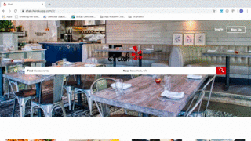

# eHah

A single-page app inspired by Yelp where users can search for businesses, view their information and review them. 

[eHah Live](https://ehah.herokuapp.com/#/)
<a href="https://ehah.herokuapp.com/#/" target="_blank">eHah Live to new tab</a>

Things you may want to cover:

* Ruby version

* System dependencies

* Configuration

* Database creation

* Database initialization

* How to run the test suite

* Services (job queues, cache servers, search engines, etc.)

* Deployment instructions

* ...
